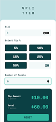
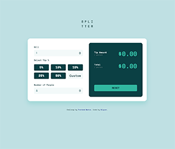

# Frontend Mentor - Tip calculator app solution

This is a solution to the [Tip calculator app challenge on Frontend Mentor](https://www.frontendmentor.io/challenges/tip-calculator-app-ugJNGbJUX). Frontend Mentor challenges help you improve your coding skills by building realistic projects.

## Table of contents

- [Overview](#overview)
  - [The challenge](#the-challenge)
  - [Screenshot](#screenshot)
  - [Links](#links)
- [My process](#my-process)
  - [Built with](#built-with)
  - [What I learned](#what-i-learned)
  - [Continued development](#continued-development)
  - [Useful resources](#useful-resources)
- [Author](#author)

## Overview

### The challenge

Users should be able to:

- View the optimal layout for the app depending on their device's screen size
- See hover states for all interactive elements on the page
- Calculate the correct tip and total cost of the bill per person

### Screenshot





### Links

- Solution URL: [https://github.com/allyson-s-code/Tip-Calculator](https://github.com/allyson-s-code/Tip-Calculator)
- Live Site URL: [https://allyson-s-code.github.io/Tip-Calculator/](https://allyson-s-code.github.io/Tip-Calculator/)

## My process

### Built with

- Semantic HTML5 markup
- CSS custom properties
- Flexbox
- Mobile-first workflow

### What I learned

I learned a lot about input forms while working on this project. I found myself changing the percent inputs from `buttons` to `input[type="radio"]` and then learning how to style the radio inputs to look like the design spec and have them still perform like an input with a `:checked` state.

I initially started by wrapping the `<input>` in a `<label>` but then realized styling the `:checked` state would be difficult
with the `<label>` elements being parent elements. In the end wrapping sibling `<input>` and `<label>` elements in a div made for the most straight forward styling with my current abilities.

```html
<div class="percent-input-container">
  <input id="15" type="radio" name="radio" value="15" class="percent-input" />
  <label for="15" class="form-control"><span>15%</span></label>
</div>
```

```css
input[type="radio"]:checked + label {
  background-color: hsl(172, 67%, 45%);
  color: hsl(183, 100%, 15%);
}
```

### Continued development

I plan on continuing with my focus on JavaScript! I feel like I have more to learn before moving on to other languages and frameworks.

### Useful resources

- [https://moderncss.dev/pure-css-custom-styled-radio-buttons/](https://moderncss.dev/pure-css-custom-styled-radio-buttons/)
- [https://developer.mozilla.org/en-US/docs/Web/HTML/Element/input/radio](https://developer.mozilla.org/en-US/docs/Web/HTML/Element/input/radio)

## Author

- Website - [Allyson Smith](https://allyson-s-code.github.io/Web-Dev-Portfolio/)
- Frontend Mentor - [@allyson-s-code](https://www.frontendmentor.io/profile/allyson-s-code)
